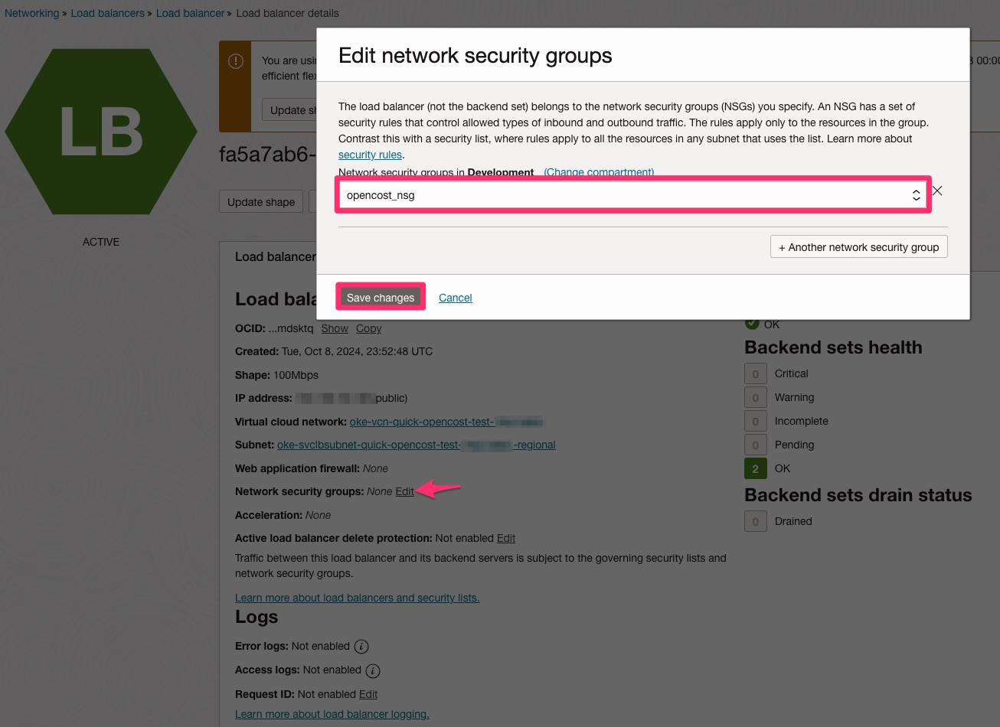
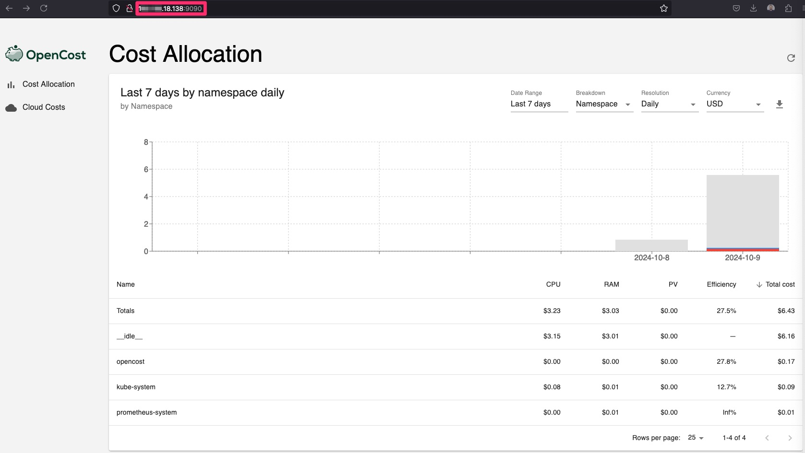

# Manage Multi-tenant SaaS Costs on OCI OKE with OpenCost

Independent Software Vendors (ISVs) providing multi-tenant SaaS solutions on Oracle Cloud Infrastructure (OCI) face the challenge of managing costs effectively while ensuring each tenant is billed accurately. Running Kubernetes clusters on Oracle Kubernetes Engine (OKE) offers scalability, but without the right tools, cost allocation can be complex, especially when tenants share the same infrastructure.

In this guide, we will walk you through an easy-to-deploy solution using **OpenCost**, an open-source cost monitoring tool that helps ISVs track and manage costs for their tenants in a multi-tenant SaaS environment on OCI OKE. We will focus on a real-world example where tenants are separated by Kubernetes namespaces, along with how to configure custom pricing for OCI resources.

## Why ISVs Need to Manage Costs for Multi-tenant SaaS Applications

As an ISV, you're likely running SaaS applications where multiple tenants share infrastructure in an OKE cluster. The challenge lies in understanding which tenant is consuming which resources—like CPU, memory, and network bandwidth—so that you can allocate costs accurately.

If you don't have visibility into resource usage per tenant, it becomes hard to:

- Accurately bill tenants for their resource usage.
- Optimize resources to avoid over-provisioning.
- Control costs, ensuring profitability for your SaaS business.

## What is OpenCost?

OpenCost is an open-source cost monitoring and management tool designed specifically for Kubernetes environments. It tracks the resource usage of your OKE clusters and allocates the costs for CPU, memory, storage, and networking. OpenCost allows you to easily map these costs to your tenants based on Kubernetes namespaces, making it an ideal solution for ISVs with multi-tenant SaaS applications.

With OpenCost, you can:

1. Allocate costs by namespace (or label) to track individual tenant usage.
2. Monitor resource consumption (CPU, memory, network) for each tenant in real-time.
3. Optimize resources to ensure efficient use of compute and storage.
4. Integrate with your billing system to automate tenant billing based on actual usage.

## Deploying OpenCost on OCI OKE for Multi-tenant SaaS Applications

Let’s go through the steps to set up OpenCost on your OKE cluster and configure it to manage costs based on Kubernetes namespaces, where each namespace corresponds to a different tenant.

**Step 1: Prerequisites**

Before getting started, make sure you have:

- An active OKE cluster in OCI.
- kubectl installed and configured to access your OKE cluster.
- Helm installed to manage your Kubernetes packages.

**Step 2: Install OpenCost on Your OKE Cluster**

To deploy OpenCost, use Helm to simplify the installation process. Here's how to install OpenCost:

1. Prometheus is a prerequisite for OpenCost installation. For the installation of Prometheus please use the following command:

```
helm install prometheus --repo https://prometheus-community.github.io/helm-charts prometheus \
  --namespace prometheus-system --create-namespace \
  --set prometheus-pushgateway.enabled=false \
  --set alertmanager.enabled=false \
  -f https://raw.githubusercontent.com/opencost/opencost/develop/kubernetes/prometheus/extraScrapeConfigs.yaml
```

2. Create the opencost namespace for your installation:

```
kubectl create namespace opencost
```

OpenCost will automatically detect OCI as the cloud service provider (CSP) by reading node information from node.spec.providerID. When OCI is detected as the CSP, OpenCost attempts to retrieve pricing data from the OCI Price List API. No API key is required to retrieve the public pricing data.

3. Install OpenCost into the opencost namespace:

```
helm install opencost --repo https://opencost.github.io/opencost-helm-chart opencost --namespace opencost
```

4. Update Opencost:

```
helm upgrade opencost --repo https://opencost.github.io/opencost-helm-chart opencost --namespace opencost
```

5. Update the service so that an external IP address is assigned to the Load Balancer.

```
kubectl patch svc opencost -n opencost -p '{"spec": {"type": "LoadBalancer"}}'
```

To access OpenCost publicly, we need to create a Network Security Group (NSG), configure an ingress rule to open the required port, and associate it with the Load Balancer..

6.  Create the Network Security Group (NSG). Be sure to replace [YOUR_COMPARTMENT_ID] with your actual Compartment ID and [YOUR_VCN_ID] with your VCN ID.

```
oci network nsg create --compartment-id [YOUR_COMPARTMENT_ID] --vcn-id [YOUR_VCN_ID] --display-name opencost_nsg
```

7. Create an ingress rule that allows TCP traffic on port 9090 from the internet. You can download the opencost-nsg-rule.json file [here](https://github.com/jpbueno/opencost-oke/blob/main/opencost-nsg-rule.json).

```
oci network nsg rules add --nsg-id [YOUR_NSG_ID] --from-json file://opencost-nsg-rule.json
```

8. Access your Load Balancer in the OCI Console and attach the newly created Network Security Group (NSG) to it:



9. Retrieve the external IP address and use it to access OpenCost via your web browser.
kubectl get svc -n opencost



If you need to familiarize yourself with OpenCost UI, this [video](https://youtu.be/lCP4Ci9Kcdg) provides a good short overview.

Congratulations! You've successfully installed and configured OpenCost on your OKE cluster!

## Cost Optimization Strategies for ISVs

After setting up OpenCost and tracking tenant usage, here are some optimization strategies you can implement:

1. **Right-size Resource Allocations**: OpenCost will show you if any tenants are over-provisioned (using too much CPU or memory for their workload). You can use this information to adjust the resource limits for each tenant's pods, ensuring you’re not paying for unused capacity.
2. **Leverage OCI's Flexible Compute Pricing**: OCI offers preemptible instances that can reduce costs significantly. Non-critical workloads for specific tenants can be shifted to these instances, offering savings.
3. **Implement Horizontal Pod Autoscaling**: Kubernetes’ Horizontal Pod Autoscaler (HPA) can automatically scale the number of pods per tenant based on resource usage. This ensures that you only pay for the resources that are actively being used.
4. **Monitor Network Egress**: OpenCost can help you track network costs for each tenant. By analyzing network traffic, you can identify potential optimizations, such as reducing cross-region traffic or using OCI’s advanced networking features to minimize costs.

## Conclusion

By integrating OpenCost with your OCI OKE cluster and configuring custom pricing, you can gain precise visibility into your multi-tenant SaaS costs. ISVs can now allocate costs fairly and accurately, ensuring that each tenant's resource usage is reflected in the final bill.

With the custom pricing feature of OpenCost, you ensure that the cost estimates align with OCI’s pricing, which is critical for maintaining profitability in a multi-tenant SaaS environment.

Author: [JP Santana](mailto:jp.santana@oracle.com)
