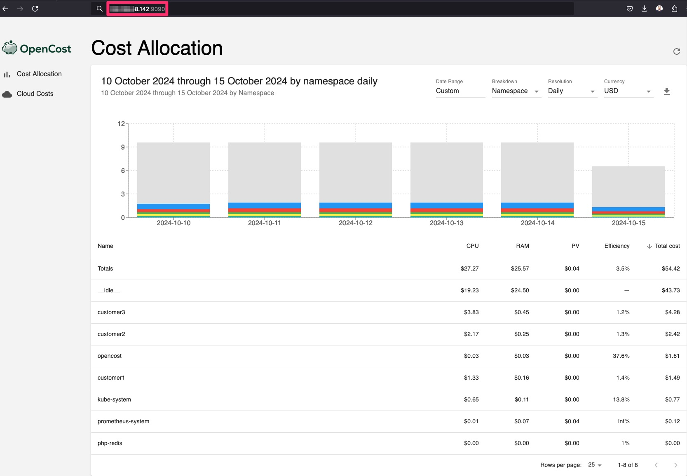

# Manage Multi-Tenant SaaS Costs on OCI Kubernetes Engine with OpenCost

## Introduction

Independent Software Vendors (ISVs) delivering multi-tenant Software as a Service (SaaS) solutions on Oracle Cloud Infrastructure (OCI) often face the challenge of managing costs efficiently while ensuring accurate billing for each tenant. A common approach among SaaS providers is to run their tenants' workloads on Kubernetes, utilizing Kubernetes namespaces to logically separate them within the same cluster. When deploying clusters on Oracle Cloud Infrastructure Kubernetes Engine (OCI Kubernetes Engine or OKE), OCI provides detailed cost data for the overall cluster. However, it is not able to provide granular cost insights for individual Kubernetes components, such as namespaces, which are crucial for tracking and billing tenant-specific resource usage.

In this tutorial, we will walk you through an easy-to-deploy solution using OpenCost, an open-source cost monitoring tool which can help track and manage costs in a multi-tenant environment on OKE.

As an ISV, you are likely running SaaS applications where multiple tenants share infrastructure within an OKE cluster. The challenge is gaining visibility into the costs associated with each tenant’s consumption of resources. Understanding these costs is essential for accurately allocating expenses and ensuring fair billing for each tenant.

If you do not have visibility into resource usage per tenant, it becomes hard to:

- Accurately bill tenants for their Kubernetes resource usage.
- Optimize resources to avoid over-provisioning.
- Control costs, ensuring profitability for your SaaS business.

OpenCost is an open-source cost monitoring and management tool designed specifically for Kubernetes environments. It tracks the resource usage of your OKE clusters and allocates the costs for CPU, memory, storage, and networking. OpenCost allows you to easily map these costs to your tenants based on Kubernetes namespaces, making it an ideal solution for ISVs with multi-tenant SaaS applications.

With OpenCost, you can:

- Allocate costs by namespace (or other Kubernetes components) to track individual tenant usage.
- Track and analyze resource consumption per tenant over a specified time period.
- Optimize tenant environments to ensure efficient use of resources.

### Objectives

- Manage multi-tenant SaaS costs on OKE with OpenCost.

### Prerequisites

- An active OKE cluster in OCI.

- kubectl installed and configured to access your OKE cluster.

- Helm installed to manage your Kubernetes packages.

- Install Prometheus. Run the following command.

  ```
  helm install prometheus --repo https://prometheus-community.github.io/helm-charts prometheus \
    --namespace prometheus-system --create-namespace \
    --set prometheus-pushgateway.enabled=false \
    --set alertmanager.enabled=false \
    -f https://raw.githubusercontent.com/opencost/opencost/develop/kubernetes/prometheus/extraScrapeConfigs.yaml
  ```

## Install OpenCost on Your OKE Cluster

1. Create the OpenCost namespace for your installation.

    ```
    kubectl create namespace opencost
    ```

    OpenCost will automatically detect OCI as the cloud service provider (CSP) by reading node information from `node.spec.providerID`. When OCI is detected as the CSP, OpenCost attempts to retrieve pricing data from the OCI Price List API. No API key is required to retrieve the public pricing data.

2. Install OpenCost into the OpenCost namespace.

    ```
    helm install opencost --repo https://opencost.github.io/opencost-helm-chart opencost --namespace opencost
    ```

3. Update OpenCost.

    ```
    helm upgrade opencost --repo https://opencost.github.io/opencost-helm-chart opencost --namespace opencost
    ```

4. Update the service so that an external IP address is assigned to the OCI Load Balancer.

    ```
    kubectl patch svc opencost -n opencost -p '{"spec": {"type": "LoadBalancer"}}'
    ```

    To access OpenCost publicly, we need to create a Network Security Group (NSG), configure an ingress rule to open the required port, and associate it with the OCI Load Balancer.

5.  Create the Network Security Group (NSG). Be sure to replace `YOUR_COMPARTMENT_ID` with your actual compartment ID and `YOUR_VCN_ID` with your VCN ID. You can retrieve this information from the OCI Console.

    ```
    oci network nsg create --compartment-id [YOUR_COMPARTMENT_ID] --vcn-id [YOUR_VCN_ID] --display-name opencost_nsg
    ```

6. Create an ingress rule that allows TCP traffic on port `9090` from the internet. You can download the `opencost-nsg-rule.json` file from here: [opencost-nsg-rule.json](./files/opencost-nsg-rule.json).

    ```
    oci network nsg rules add --nsg-id [YOUR_NSG_ID] --from-json file://opencost-nsg-rule.json
    ```

7. Attach the newly created Network Security Group (NSG) to the OCI Load Balancer. Replace `YOUR_LB_ID` with your load balancer ID and `YOUR_NSG_ID` with your Network Security Group ID.

    ```
    oci lb nsg update --load-balancer-id [YOUR_LB_ID] --nsg-ids '[ "[YOUR_NSG_ID]" ]'
    ```

    

9. Retrieve the external IP address and use it to access OpenCost using your web browser. Run the `kubectl get svc -n opencost` command.

    

    To get familiar with the OpenCost UI, see [Video: See How OpenCost Tracks Your Kubernetes Costs and Cloud Billing](https://youtu.be/lCP4Ci9Kcdg).

    Congratulations! You have successfully installed and configured OpenCost on your OKE cluster!

## Next Steps

By integrating OpenCost with your OKE cluster and configuring custom pricing, you can gain precise visibility into your multi-tenant SaaS costs. ISVs can now allocate costs fairly and accurately, ensuring that each tenant's resource usage is reflected in the final bill.

With the custom pricing feature of OpenCost, you ensure that the cost estimates align with OCI’s pricing, which is critical for maintaining profitability in a multi-tenant SaaS environment.

## Related Links

- [Installing OpenCost on Oracle Cloud Infrastructure (OCI)](https://www.opencost.io/docs/configuration/oracle)

## Acknowledgments

- **Author** - JP Santana, Master Cloud Architect
