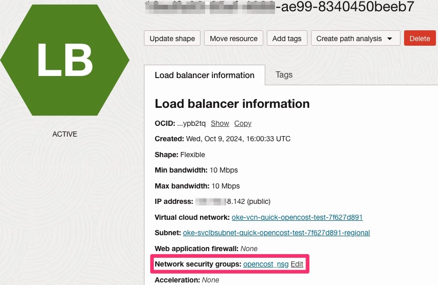

# Manage Multi-tenant SaaS Costs on OCI OKE with OpenCost

## Introduction

Independent Software Vendors (ISVs) delivering multi-tenant SaaS solutions on OCI often face the challenge of managing costs efficiently while ensuring accurate billing for each tenant. A common approach among SaaS providers is to run their tenants' workloads on Kubernetes, utilizing Kubernetes Namespaces to logically separate them within the same cluster. When deploying clusters on Oracle Kubernetes Engine (OKE), OCI provides detailed cost data for the overall cluster. However, it is not able to provide granular cost insights for individual Kubernetes components, such as Namespaces, which are crucial for tracking and billing tenant-specific resource usage.

In this tutorial, we will walk you through an easy-to-deploy solution using **OpenCost**, an open-source cost monitoring tool can help OKE customers track and manage costs for their tenants in a multi-tenant environment on OKE.

### Objectives

As an ISV, you’re likely running SaaS applications where multiple tenants share infrastructure within an OKE cluster. The challenge is gaining visibility into the costs associated with each tenant’s consumption of resources such as CPU, memory, and network bandwidth. Understanding these costs is essential for accurately allocating expenses and ensuring fair billing for each tenant.

If you don't have visibility into resource usage per tenant, it becomes hard to:

- Accurately bill tenants for their resource usage.
- Optimize resources to avoid over-provisioning.
- Control costs, ensuring profitability for your SaaS business.

OpenCost is an open-source cost monitoring and management tool designed specifically for Kubernetes environments. It tracks the resource usage of your OKE clusters and allocates the costs for CPU, memory, storage, and networking. OpenCost allows you to easily map these costs to your tenants based on Kubernetes namespaces, making it an ideal solution for ISVs with multi-tenant SaaS applications.

With OpenCost, you can:

1. Allocate costs by namespace (or any other Kubernetes component) to track individual tenant usage.
2. Monitor resource consumption (CPU, memory, network) for each tenant in real-time.
3. Optimize resources to ensure efficient use of compute and storage.
4. Integrate with your billing system to automate tenant billing based on actual usage.

### Prerequisites

Before getting started, make sure you have:

- An active OKE cluster in OCI.
- kubectl installed and configured to access your OKE cluster.
- Helm installed to manage your Kubernetes packages.

<!-- Start your tasks here. Tasks must begin with a heading 2 (##). Create as many task sections as needed. -->

## Install OpenCost on Your OKE Cluster

1. Prometheus is a prerequisite for OpenCost installation. For the installation of Prometheus please use the following command:

```
helm install prometheus --repo https://prometheus-community.github.io/helm-charts prometheus \
  --namespace prometheus-system --create-namespace \
  --set prometheus-pushgateway.enabled=false \
  --set alertmanager.enabled=false \
  -f https://raw.githubusercontent.com/opencost/opencost/develop/kubernetes/prometheus/extraScrapeConfigs.yaml
```

2. Create the opencost namespace for your installation:

```
kubectl create namespace opencost
```

OpenCost will automatically detect OCI as the cloud service provider (CSP) by reading node information from node.spec.providerID. When OCI is detected as the CSP, OpenCost attempts to retrieve pricing data from the OCI Price List API. No API key is required to retrieve the public pricing data.

3. Install OpenCost into the opencost namespace:

```
helm install opencost --repo https://opencost.github.io/opencost-helm-chart opencost --namespace opencost
```

4. Update Opencost:

```
helm upgrade opencost --repo https://opencost.github.io/opencost-helm-chart opencost --namespace opencost
```

5. Update the service so that an external IP address is assigned to the Load Balancer.

```
kubectl patch svc opencost -n opencost -p '{"spec": {"type": "LoadBalancer"}}'
```

To access OpenCost publicly, we need to create a Network Security Group (NSG), configure an ingress rule to open the required port, and associate it with the Load Balancer..

6.  Create the Network Security Group (NSG). Be sure to replace [YOUR_COMPARTMENT_ID] with your actual Compartment ID and [YOUR_VCN_ID] with your VCN ID. You can retrieve this information from the OCI Console.

```
oci network nsg create --compartment-id [YOUR_COMPARTMENT_ID] --vcn-id [YOUR_VCN_ID] --display-name opencost_nsg
```

7. Create an ingress rule that allows TCP traffic on port 9090 from the internet. You can download the opencost-nsg-rule.json file [here](./files/opencost-nsg-rule.json).

```
oci network nsg rules add --nsg-id [YOUR_NSG_ID] --from-json file://opencost-nsg-rule.json
```

8. Attach the newly created Network Security Group (NSG) to the Load Balancer. Replace [YOUR_LB_ID] with your Load Balancer ID and [YOUR_NSG_ID] with your Network Security Group ID:

```
oci lb nsg update --load-balancer-id [YOUR_LB_ID] --nsg-ids '[ "[YOUR_NSG_ID]" ]'
```



9. Retrieve the external IP address and use it to access OpenCost via your web browser.
kubectl get svc -n opencost


If you'd like to get familiar with the OpenCost UI, this short [video](https://youtu.be/lCP4Ci9Kcdg) provides a great overview.

Congratulations! You've successfully installed and configured OpenCost on your OKE cluster!

## Conclusion

By integrating OpenCost with your OCI OKE cluster and configuring custom pricing, you can gain precise visibility into your multi-tenant SaaS costs. ISVs can now allocate costs fairly and accurately, ensuring that each tenant's resource usage is reflected in the final bill.

With the custom pricing feature of OpenCost, you ensure that the cost estimates align with OCI’s pricing, which is critical for maintaining profitability in a multi-tenant SaaS environment.

## Related Links

Provide links to additional resources. This section is optional; delete if not needed.

- [Installing on Oracle Cloud Infrastructure (OCI)](https://www.opencost.io/docs/configuration/oracle)

## Acknowledgments

List the names and title of authors and contributors. This section is optional; delete if not needed.

- **Author** - name (JP Santana), name (Master Cloud Architect)

